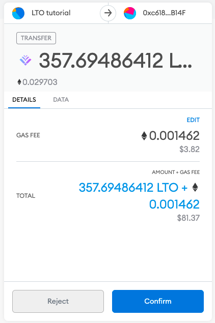
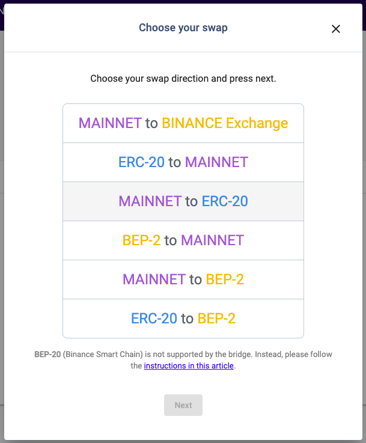
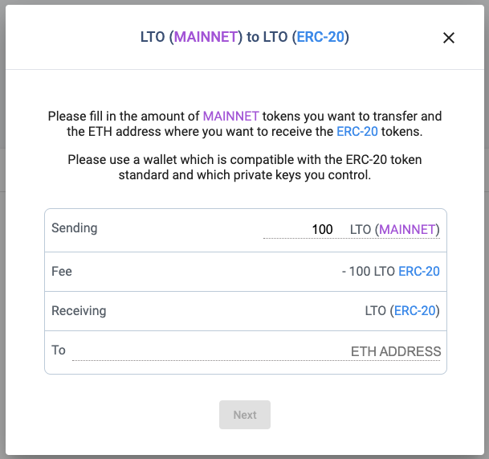

# Using the LTO token bridge

LTO's token bridge helps you convert from the exchange tokens on ERC-20 or BEP-2 to the utility tokens on the mainnet and vice versa. You can even convert from one exchange token to another, however, keep in mind that fees can vary greatly between different exchange variants due to ETH or BSC network fees. Converting from exchange tokens to mainnet being usually the lowest fee. BEP-20 is currently not supported by the token bridge but you can still swap these tokens following [this tutorial](https://blog.ltonetwork.com/how-to-swap-lto-bep2-to-lto-bep20/).

## Exchange token to mainnet

To start things off, we'll assume you have LTO tokens in your wallet and would like to convert them to mainnet tokens, e.g., to stake them with one of the community nodes. This direction has minimal fees, at present 10 LTO. The initial situation might look like this:

Essentially, all you need to do is transfer your LTO tokens to an address and that's it. To find out your address for this transaction head over to [https://wallet.lto.network/](https://wallet.lto.network/), log into your LTO web wallet, and select **Bridge** in the options menu on the left side. The following dialog will appear where you need to select the exchange token you have (ERC-20 in this tutorial) and the token you want to exchange for (mainnet in this tutorial).

As you see in the picture above on the left a token address will be generated for you depending on the exchange token you selected. In this tutorial we selected ETH and hence will transfer our token from MetaMask to the address provided by the token bridge:&#x20;


Transactions always use us fees, so-called gas fees, for example, ETH for ERC-20 tokens. If you want to transfer your LTO exchange tokens you should have enough native tokens to cover the transaction.&#x20;


MetaMask will notify you once the transaction goes through. Shortly after you should also receive your LTO mainnet tokens in your web wallet.&#x20;

## Mainnet to exchange token

A mainnet to exchange token swap has higher fees due to the higher transaction fees on the side of the bridge. In this tutorial, we will be transferring mainnet LTO tokens from our web wallet to the MetaMask wallet, and thus the gas fees are paid by the bridge. To counter this the LTO mainnet fees are higher to pay for these gas fees. At present, a transaction from a mainnet to an ERC-20 address costs 100 LTO. Depending on the ETH price and gas fees per transaction these LTO fees might increase or decrease. Prices for BEP-2 may vary as well, since it's a different network.

To start our transaction select **Bridge** in the options menu of your web wallet. For this tutorial, we will perform an LTO mainnet to ERC-20 transaction.

Next, you need to provide the number of tokens you're sending _plus an additional 100 LTO fee_. This is made transparent in the following transfer dialog. Once the **receiving** amount looks good to you provide the ETH address you would like to receive your tokens at and you're done.

After the transfer will go through (might take a few minutes) you will be able to see your LTO tokens in your wallet, provided you added LTO Network tokens to your wallet overview:

